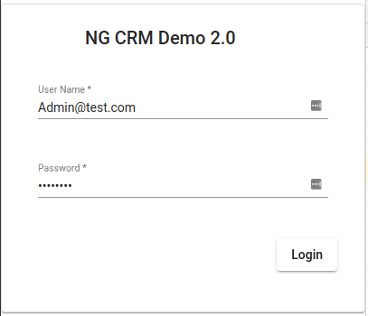
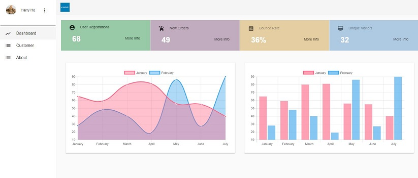
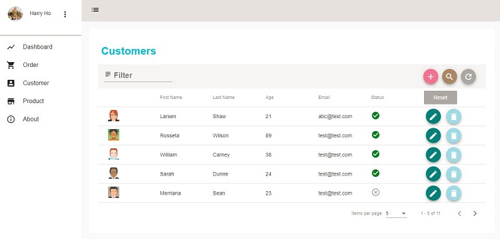
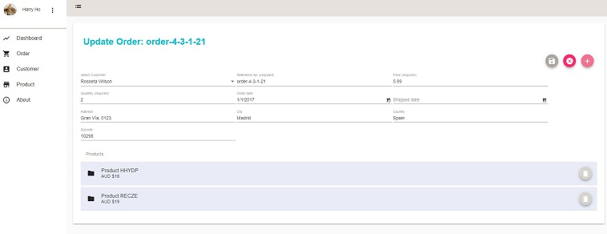

## Angular Demo App V3 (WIP)

> A reusable Angular starter project for real-world business based on Angular 19, Angular-Material 19.x.

This project was built with [Angular CLI](https://angular.dev/tools/cli) version 19.x. The goal of this project is to explorer Anguar 19 features. It can be used as foundation for creation of similar Angular App.


## Build & Setup

```bash
# Clone project
git clone https://github.com/harryho/ng-crm.git


# Install Angular CLI
npm install -g @angular/cli

# prepare Json-Server as fake Restful API
cd ng-crm


# Install the packages with npm
npm install


# Start the app with npm
npm start
# Or use ng
ng serve 

# Test with npm
npm run test
# Or use ng
ng test


# build for production 
npm run build

# run as production
install -g serve
serve dist

```

## Docker

```
## Run / Test release without building new image
npm run build

# Launch nginx image to test latest release
docker pull nginx:alpine
docker run -p 8080:80 -v \
    <your_aboslute_path>/dist:/usr/share/nginx/html nginx:alpine


# Build release image
docker build . -t  nc-demo:3.0

# Launch the development image in the backgroud
docker run -d --publish 8080:80  --name ng-demo3 nc-demo:3.0

# Check the log
docker logs ng-demo3  -f
```

### Live Demo


### Screenshots

<!--  -->
#### V3 Live Screenshots

[Live Demo V3](https://angular-app-demo.harryho.org?v=3): The demo is just a proof of concept. It doesn't have back-end API.


#### V2 Live Screenshots

[Demo App](https://angular-app-demo.harryho.org): The demo is just a proof of concept. It doesn't have back-end API.





<!--  -->


## Welcome to fork or clone!

For detailed explanation on how things work, checkout following links please.

* [angular](https://angular.dev/)
* [angular-material](https://material.angular.io/)
* [rxjs](https://rxjs.dev/api)


###  Change log

* Dec 2024 - Uplift from version 9 to 19. Work in progress.

* Jun 2020 - Re-create the project with Angular CLI

  The whole project is built from scratch based on the Angular CLI & Angular Material Schematics.

* Oct 2018 - Rebase demo branch to master

  New master doesn't rely on Json-Server as fake API. It will only have Readonly fake API. It means any new or updated data will be stored to any physical file. All test data will be rolled back after system restart.

* Jan 2018 - Create an archived branch json-server

  This branch was the master which used Json-Server as fake API. Considering the hiccup of setting Json-Server up and maintenance, it will be replaced by fake service ( Readonly fake API). You still can find clone this branch by branch name __json-server__, but it will be no longer updated. It is an archived branch.
