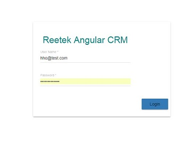
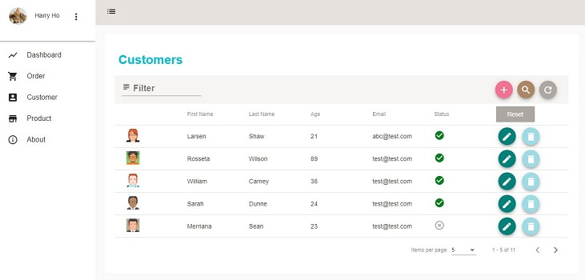

# Angular CRM Demo App

> A reusable CRM starter project for real-world business based on Angular 9, Angular-Material 9.x.

This project was generated with [Angular CLI](https://github.com/angular/angular-cli) version 9.x. The goal of this project is to create reusable project for real-world business. To achieve this target, we need a solution which includes simple authentication process, restful API feature with token support and simple but elegant UI design.

#### Features

* This project is built on the top of AngularClass/Angular-Starter.
* The UI part of this project is comprehensively built on Angular Material.
* This project includes ng-charts.
* ~~To simulate real-world business, this starter project chooses Json-Server as fake Restful API. (You can simple replace it with your own API).~~
* ~~Fake API is just readonly fake service.~~


#### Live Demo
[Demo App](https://angular-app-demo.harryho.org): The demo is just a proof of concept. It doesn't have back-end API and all features of master branch.

#### Screenshots







## Build & Setup

```bash
# Clone project
git clone https://github.com/harryho/ng-crm.git


# Install Angular CLI
npm install -g @angular/cli

# prepare Json-Server as fake Restful API
cd ng-crm


# Install the packages with npm
npm install


# Start the app with npm
npm start
# Or use ng
ng serve 

# Test with npm
npm run test
# Or use ng
ng test


# build for production 
npm run build --prod=true

# run as production
install -g serve
serve dist

```

## Docker

```
## Run / Test release without building new image
npm run build

# Launch nginx image to test latest release
docker pull nginx:alpine
docker run -p 8080:80 -v \
    <your_aboslute_path>/dist:/usr/share/nginx/html nginx:alpine


# Build release image
docker build . -t  nc-prd:2.0

# Launch the development image in the backgroud
docker run -d --publish 8080:80  --name nc2 nc-prd:2.0

# Check the log
docker logs nc2  -f
```

## Welcome to fork or clone!

For detailed explanation on how things work, checkout following links please.

* [angular](https://angular.io/)
* [angular-material](https://material.angular.io/)
* [ng-charts](https://github.com/valor-software/ng2-charts)
* [rxjs](https://rxjs.dev/api)


#### Alternatives

There are some similar projects respectively built on the Vue.js and React. If you have interests in those technical stacks. You can find and clone those repositories below.

* [Vue-Crm](https://github.com/harryho/vue-crm.git).
* [React-Crm](https://github.com/harryho/react-crm.git).


###  Change log

* Jun 2020 - Re-create the project with Angular CLI

  The whole project is built from scratch based on the Angular CLI & Angular Material Schematics.

* Oct 2018 - Rebase demo branch to master

  New master doesn't rely on Json-Server as fake API. It will only have Readonly fake API. It means any new or updated data will be stored to any physical file. All test data will be rolled back after system restart.

* Jan 2018 - Create an archived branch json-server

  This branch was the master which used Json-Server as fake API. Considering the hiccup of setting Json-Server up and maintenance, it will be replaced by fake service ( Readonly fake API). You still can find clone this branch by branch name __json-server__, but it will be no longer updated. It is an archived branch.
