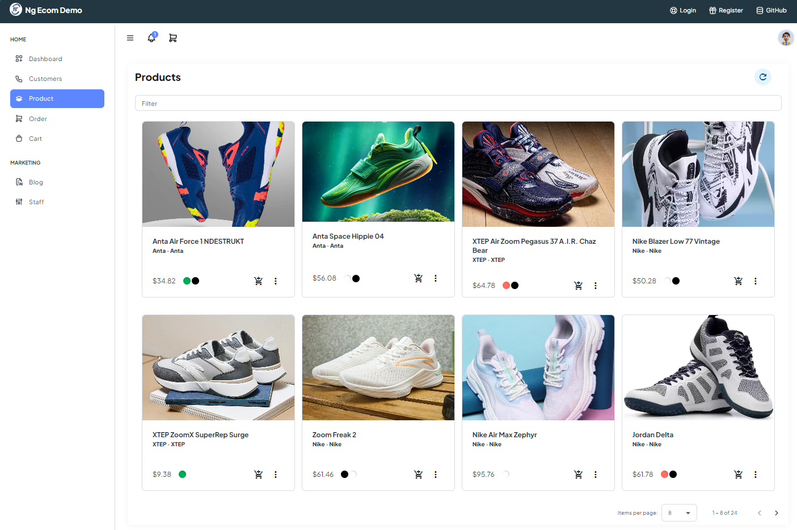
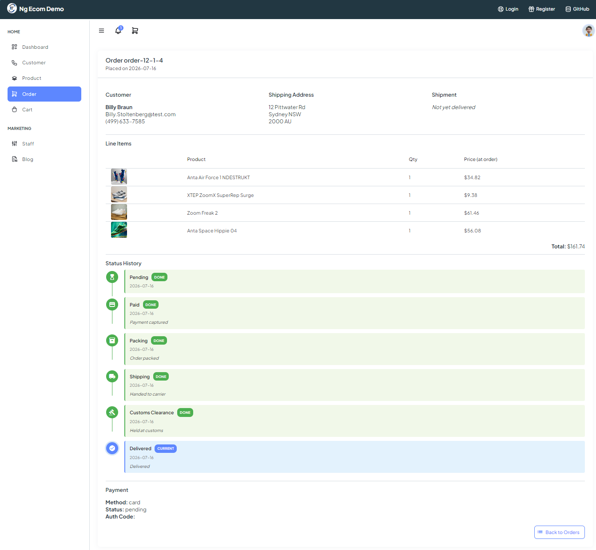
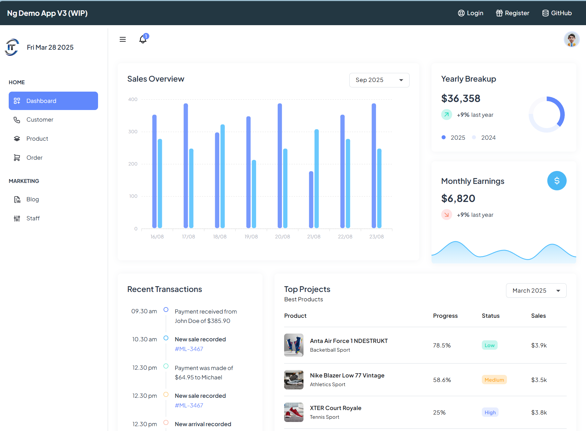
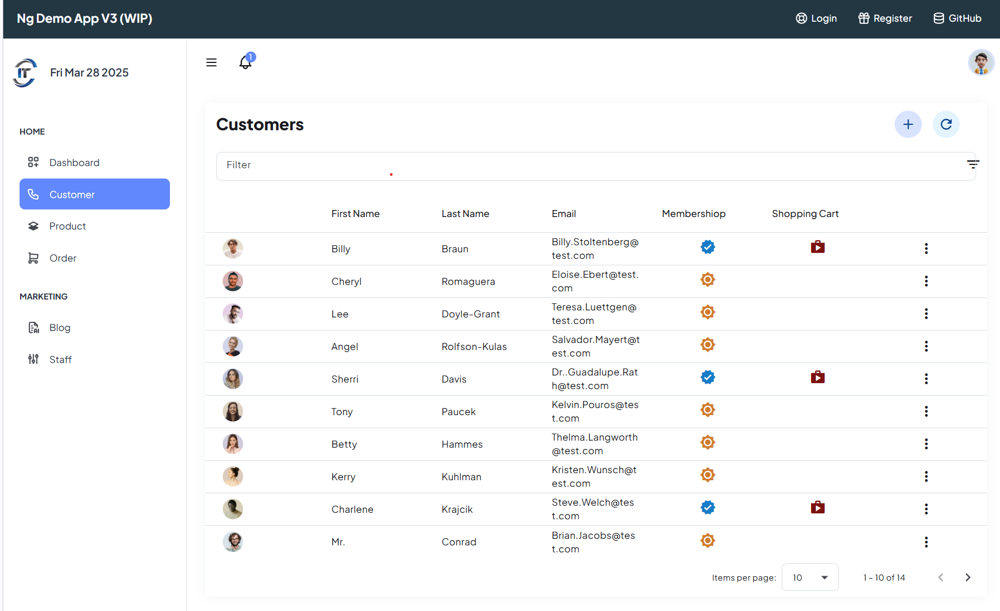

## Angular Ecom Demo

> A reusable Angular starter project for real-world business apps based on Angular 22 and Angular Material 22.

This project was built with [Angular CLI](https://angular.dev/tools/cli) version 22.x. It demonstrates a modern Angular single-page app with standalone components, signals, RxJS, and Angular Material.

## Architecture

The app uses an **in-memory data layer** — no backend server is required.

- `src/app/data/seed.ts` holds the deterministic demo data (users, products, orders, staff, categories, carriers).
- `src/app/data/repository.ts` provides the runtime data store and CRUD operations.
- Services are thin wrappers over the repository.
- All data resets to the seed state when the page is reloaded.

## Requirements

- Node.js >= 22.0.0
- npm >= 10

## Build & Setup

```bash
# Clone project
git clone https://github.com/harryho/ng-crm.git
cd ng-crm

# Install dependencies
npm install

# Start the development server
npm start
# Or directly with Angular CLI
ng serve

# Run unit tests
npm run test
# Or directly with Angular CLI
ng test

# Build for production
npm run build
```

The production build is emitted to `dist/ngDemo/browser`.

## Docker

Build and run the app inside a container with nginx:

```bash
# Build the release image
docker build . -t nc-demo:3.5

# Run the container in the background
docker run -d --publish 8080:80 --name ng-demo3 nc-demo:3.5

# View logs
docker logs ng-demo3 -f
```

The bundled app is served from `/usr/share/nginx/html` with a fallback to `index.html` for Angular routing.

## Deploying to IIS

For an IIS release, build the production bundle and copy it to an IIS site:

```bash
npm run build -- --configuration=production
```

Copy the contents of `dist/ngDemo/browser` to your IIS website folder. Add a `web.config` with a URL Rewrite rule so deep links fall back to `index.html`:

```xml
<?xml version="1.0" encoding="utf-8"?>
<configuration>
  <system.webServer>
    <rewrite>
      <rules>
        <rule name="Angular Routes" stopProcessing="true">
          <match url=".*" />
          <conditions logicalGrouping="MatchAll">
            <add input="{REQUEST_FILENAME}" matchType="IsFile" negate="true" />
            <add input="{REQUEST_FILENAME}" matchType="IsDirectory" negate="true" />
          </conditions>
          <action type="Rewrite" url="/index.html" />
        </rule>
      </rules>
    </rewrite>
    <staticContent>
      <mimeMap fileExtension=".webp" mimeType="image/webp" />
    </staticContent>
  </system.webServer>
</configuration>
```

If the site is served from a subfolder (e.g., `/ng-crm/`), build with:

```bash
npm run build -- --configuration=production --base-href=/ng-crm/
```

And update the rewrite action to `/ng-crm/index.html`.

## Live Demo

### Live Screenshots





### Previous Screenshots





## Welcome to fork or clone!

For detailed explanations on how things work, check out the following links:

- [Angular](https://angular.dev/)
- [Angular Material](https://material.angular.io/)
- [RxJS](https://rxjs.dev/api)

## Change log

- **Jul 2026** — Aligned README with the current codebase: Angular 22, in-memory repository, no Json-Server, corrected Docker/IIS instructions, and removed legacy backend service.
- **Dec 2024** — Uplift from Angular 9 to Angular 19+. Work in progress.
- **Jun 2020** — Re-created the project with Angular CLI.
- **Oct 2018** — Rebased demo branch to master. Removed Json-Server dependency in favor of an in-memory fake API.
- **Jan 2018** — Created archived `json-server` branch. No longer updated.
